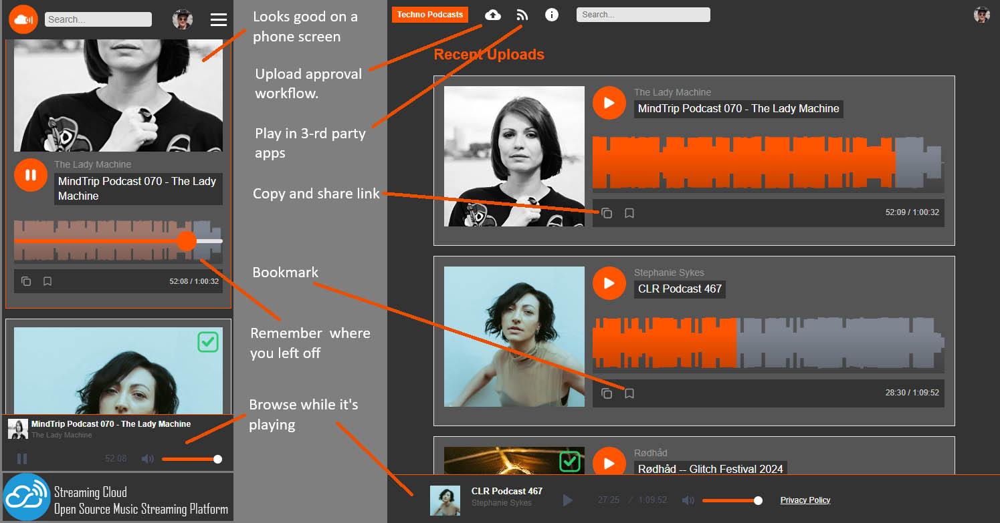

# Streaming Cloud

Open-source, self-hosted music streaming platform built on AWS. Upload tracks, stream audio, manage users, and publish an RSS feed — all from your own domain.

# Who needs it and why?

Hi, I'm Peter Wolf, the founder of Streaming Cloud. I've been making and DJing techno music for quite some time. I also have a life long career in software development. As a DJ and producer, I felt that I don't have much choice on where to host my music. Most streaming platforms (Apple, Spotify, Amazon, etc.) are designed for serving (or selling) individual songs, which is perfectly fine for top 40 music. Techno, however, is meant to be mixed in multi-hour DJ sets. Listening to individual techno tracks makes very little sense. I'm sure this applies to some other genres of music as well. What's left? Youtube started interrupting sets with ads, which is not a great experience: tt's like turning on the lights on the dance floor in the middle of the party night. Not good. SoundCloud allows DJ sets, but you either limited to a couple of sets or it gets expensive, not to mention that your set will be lost among millions of short tracks. MixCloud? Well, I just don't like it. So... I guess this is it? That gave me sufficient motivation to build a platform that...

- Free and Open Source
- Highly customizable
- Hosting that costs only a tiny fraction of what premium subscriptions would cost per user.
- Infinitely scalable using the modern cloud tech. 1 listener or a million -- it won't slow down or crash.
- Works well on computers and phones natively, or via the 3-rd party apps using an open standard protocol (RSS)
- Not bloated with useless social media hooks. "Less is more" not only applies to techno music but also to software. As a side effect of that it should deter people with a wrong motivation: the lack of counters for plays, likes and shares, lack of comments and such would only retain the uploaders who truly love sharing their craft and not those who chase validation in numbers. Zero ego platform, basically. 
- Not every set is great so the host (you) should have an (optional) way to approve or reject someone's  upload.
- You can resume where you left off, across devices. Especially important for long DJ sets!
- Looks pretty and delightful to use.



**Live features:** audio player with waveform visualization, user accounts (email + Google login), bookmarks, search, RSS podcast feed, admin panel for user and content management.

## Architecture Overview

Streaming Cloud is deployed as a single AWS CDK stack. Everything runs serverlessly:

| Component | AWS Service |
|-----------|-------------|
| Frontend (SPA) | S3 + CloudFront |
| API | API Gateway + Lambda |
| Auth | Cognito (email + Google OAuth) |
| Database | DynamoDB |
| Audio storage | S3 |
| Waveform generation | Step Functions + Lambda + FFmpeg layer |
| RSS feed | Lambda on EventBridge schedule |
| DNS & TLS | Route 53 + ACM |

## Prerequisites

Before you begin, make sure you have the following installed and ready:

1. **Node.js** (v18 or later) — [Download](https://nodejs.org/)
2. **AWS CLI** — [Install guide](https://docs.aws.amazon.com/cli/latest/userguide/getting-started-install.html)
3. **AWS CDK CLI** — install globally after Node.js:
   ```
   npm install -g aws-cdk
   ```
4. **An AWS account** with admin access (or at least permissions to create IAM roles, Lambda, DynamoDB, S3, CloudFront, Cognito, Route 53, ACM, Step Functions, and EventBridge)
5. **A registered domain name** with its DNS hosted in AWS Route 53

### First-time AWS CDK users

If you have never used CDK in your AWS account/region before, you need to bootstrap it once:

```bash
cdk bootstrap aws://YOUR_ACCOUNT_ID/us-east-1
```

You can find your account ID by running `aws sts get-caller-identity`.

## Quick Start

### Step 1 — Clone and install dependencies

```bash
git clone https://github.com/wolfpet/StreamingCloud.git
cd StreamingCloud
npm install
cd lambda && npm install && cd ..
```

### Step 2 — Create your site configuration

Copy the example config and fill in your values:

```bash
cp site.config.example.json site.config.json
```

Open `site.config.json` in your editor and update at minimum:

| Field | What to put |
|-------|------------|
| `site.domainName` | Your domain (e.g. `mysite.com`) |
| `site.title` | Your site's display name |
| `site.contactEmail` | Public contact email address |
| `brand.accentColor` | Primary color as hex (e.g. `#ff5500`) |
| `rss.title` | Title for your RSS/podcast feed |
| `rss.description` | Description for your RSS feed |
| `rss.author` | Author name shown in podcast apps |
| `rss.category` | Feed category (e.g. `Music`) |

See [Configuration Reference](#configuration-reference) below for all available options.

### Step 3 — Set up Google OAuth (for "Sign in with Google")

Streaming Cloud uses Google OAuth for social login. You need to create credentials and store them securely in AWS.

#### 3a. Create Google OAuth credentials

1. Go to the [Google Cloud Console](https://console.cloud.google.com/apis/credentials)
2. Create a new project (or select an existing one)
3. Go to **APIs & Services → Credentials → Create Credentials → OAuth client ID**
4. Choose **Web application**
5. Under **Authorized redirect URIs**, add:
   ```
   https://YOUR_DOMAIN_PREFIX.auth.us-east-1.amazoncognito.com/oauth2/idpresponse
   ```
   (Replace `YOUR_DOMAIN_PREFIX` with your domain name minus the TLD — e.g. for `mysite.com` use `mysite`)
6. Save and note your **Client ID** and **Client Secret**

#### 3b. Store credentials in AWS Systems Manager Parameter Store

The deploy script reads Google credentials from SSM so they are never stored in code. Run these commands (replace the values):

```bash
aws ssm put-parameter \
  --name "/YOUR_DOMAIN_PREFIX/secrets/google-client-id" \
  --value "YOUR_GOOGLE_CLIENT_ID" \
  --type SecureString

aws ssm put-parameter \
  --name "/YOUR_DOMAIN_PREFIX/secrets/google-client-secret" \
  --value "YOUR_GOOGLE_CLIENT_SECRET" \
  --type SecureString
```

> **Example:** If your domain is `mysite.com`, the SSM path is `/mysite/secrets/google-client-id`.

### Step 4 — Create the FFmpeg Lambda Layer

The waveform visualization feature requires FFmpeg. You need to publish it as a Lambda layer once before your first deploy.

**On Windows (PowerShell):**

```powershell
.\create-ffmpeg-layer.ps1
```

**On Linux/macOS (manual steps):**

```bash
mkdir -p lambda-layer-final/bin
cp ffmpeg-layer/bin/ffmpeg-7.0.2-amd64-static/ffmpeg lambda-layer-final/bin/
cp ffmpeg-layer/bin/ffmpeg-7.0.2-amd64-static/ffprobe lambda-layer-final/bin/
cd lambda-layer-final && zip -r ../ffmpeg-layer.zip bin/ && cd ..
aws lambda publish-layer-version \
  --layer-name ffmpeg-layer \
  --zip-file fileb://ffmpeg-layer.zip \
  --compatible-runtimes nodejs24.x \
  --region us-east-1
```

> **Note:** The layer must be published in `us-east-1` because Lambda@Edge functions run there.

### Step 5 — Set up your domain in Route 53

If your domain isn't already in Route 53:

1. Go to the [Route 53 console](https://console.aws.amazon.com/route53/)
2. Click **Hosted zones → Create hosted zone**
3. Enter your domain name and click **Create**
4. Update your domain registrar's nameservers to the four NS records shown in Route 53

> Allow up to 48 hours for DNS propagation if you're transferring from another provider.

### Step 6 — Deploy

Use the deploy script, which securely fetches your Google OAuth credentials from SSM:

**On Windows (PowerShell):**

```powershell
.\deploy.ps1
```

**On Linux/macOS:**

```bash
# Load SSM prefix from config
DOMAIN=$(cat site.config.json | python3 -c "import sys,json; print(json.load(sys.stdin)['site']['domainName'])")
PREFIX="/${DOMAIN%%.*}/secrets"

export GOOGLE_CLIENT_ID=$(aws ssm get-parameter --name "$PREFIX/google-client-id" --with-decryption --query "Parameter.Value" --output text)
export GOOGLE_CLIENT_SECRET=$(aws ssm get-parameter --name "$PREFIX/google-client-secret" --with-decryption --query "Parameter.Value" --output text)

cdk deploy --require-approval never
```

The first deploy takes about 15–20 minutes (CloudFront distribution creation is the slowest part). Subsequent deploys are much faster.

### Step 7 — Verify

Once deployed, visit `https://YOUR_DOMAIN.com` to see your site. You should be able to:

- Create an account and sign in
- Upload a track
- Play audio with the waveform player
- Access the RSS feed at `https://YOUR_DOMAIN.com/rss/feed.xml`

## Configuration Reference

All configuration lives in `site.config.json`. Here is every available option:

### `site` — Core site settings

| Key | Type | Description |
|-----|------|-------------|
| `domainName` | string | **Required.** Your domain (e.g. `mysite.com`) |
| `title` | string | **Required.** Site title shown in browser tab and header |
| `tagline` | string | Subtitle shown on the homepage |
| `playerSubtitle` | string | Text shown below the audio player |
| `contactEmail` | string | **Required.** Email shown on the contact page |
| `contentNoun` | string | Label for content items (default: `"Podcast"`) |

### `brand` — Visual identity

| Key | Type | Description |
|-----|------|-------------|
| `accentColor` | string | **Required.** Primary brand color as 6-digit hex (e.g. `#ff5500`) |
| `accentColorLight` | string | Lighter variant for gradients (e.g. `#ff8800`) |
| `consoleBannerEmoji` | string | Emoji shown in browser console banner |

### `seo` — Search engine optimization

| Key | Type | Description |
|-----|------|-------------|
| `googleSiteVerification` | string | Google Search Console verification meta tag value |

### `cognito` — Authentication settings

| Key | Type | Description |
|-----|------|-------------|
| `refreshTokenValidityDays` | number | How long refresh tokens last (default: `365`) |
| `minPasswordLength` | number | Minimum password length (default: `7`) |

### `rss` — Podcast RSS feed

| Key | Type | Description |
|-----|------|-------------|
| `title` | string | **Required.** Feed title |
| `description` | string | **Required.** Feed description |
| `author` | string | **Required.** Feed author name |
| `category` | string | **Required.** Feed category |
| `language` | string | Language code (default: `en-us`) |
| `scheduleMinutes` | number | How often to regenerate the feed (default: `120`) |
| `feedLimit` | number | Max items in the feed (default: `50`) |

### `email` — Custom email forwarding (optional)

| Key | Type | Description |
|-----|------|-------------|
| `provider` | string | Email provider (`"none"` to disable) |
| `mxRecords` | array | MX records for email routing |
| `spfRecord` | string | SPF TXT record value |

### `lambda` — Performance tuning

| Key | Type | Description |
|-----|------|-------------|
| `volumeLevelsMemoryMb` | number | Memory for audio analysis Lambda (default: `3008`) |

### `upload` — Upload settings

| Key | Type | Description |
|-----|------|-------------|
| `presignedUrlExpirySeconds` | number | How long upload URLs remain valid (default: `3600`) |

### `playback` — Playback history

| Key | Type | Description |
|-----|------|-------------|
| `historyTtlDays` | number | Days to keep playback history (default: `100`) |
| `expiredMarkerTtlDays` | number | Days to keep expired markers (default: `7`) |

### `messages` — User messaging

| Key | Type | Description |
|-----|------|-------------|
| `maxLength` | number | Max message length in characters (default: `5000`) |

### `waveform` — Waveform visualization

| Key | Type | Description |
|-----|------|-------------|
| `width` | number | Waveform image width in pixels (default: `800`) |
| `height` | number | Waveform image height in pixels (default: `100`) |

## Updating an Existing Deployment

After making changes to your code or config:

```bash
.\deploy.ps1          # Windows
# or
# follow the Linux deploy steps above
```

CDK will only update the resources that changed.

## Tearing Down

To remove all deployed resources:

```bash
cdk destroy
```

> **Warning:** This will delete your S3 buckets, DynamoDB tables, and all data. Make backups first.

## Project Structure

```
├── bin/                     # CDK app entry point
├── lib/                     # CDK stack definition + config loader
├── lambda/                  # All Lambda function handlers
├── frontend/                # Static site (HTML)
│   ├── scripts/             # Frontend JavaScript modules
│   ├── styles/              # CSS stylesheets
│   ├── docs/                # Static pages (terms, privacy, contact)
│   └── plyr/                # Bundled audio player library
├── ffmpeg-layer/            # FFmpeg static binaries for Lambda layer
├── site.config.example.json # Template — copy to site.config.json
├── deploy.ps1               # Deploy script (fetches secrets from SSM)
├── create-ffmpeg-layer.ps1  # One-time FFmpeg layer setup
└── test/                    # Jest tests
```

## Customizing Legal Pages

The files in `frontend/docs/` (terms of service, privacy policy, contact page) contain placeholder legal text. **You must review and update these for your jurisdiction** before running a public site.

## Troubleshooting

| Problem | Solution |
|---------|----------|
| `site.config.json not found` | Copy `site.config.example.json` to `site.config.json` and fill in your values |
| `GOOGLE_CLIENT_ID is undefined` | Make sure to deploy using `deploy.ps1`, not `cdk deploy` directly |
| `FFmpeg layer not found` | Run `create-ffmpeg-layer.ps1` before your first deploy |
| `HostedZone not found` | Create a Route 53 hosted zone for your domain first |
| `Certificate validation timeout` | Make sure your domain's nameservers point to Route 53 |
| `AccessDenied on S3` | CDK is still propagating permissions — wait a minute and refresh |

## CDK Useful Commands

| Command | Description |
|---------|-------------|
| `npx cdk synth` | Generate the CloudFormation template (good for previewing) |
| `npx cdk diff` | Show what would change on next deploy |
| `npx cdk deploy` | Deploy (use `deploy.ps1` instead to include secrets) |
| `npm run test` | Run Jest unit tests |

## License

[BSD 2-Clause License](LICENSE)
